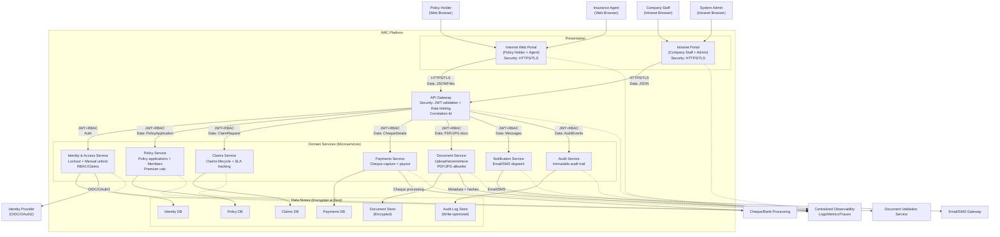
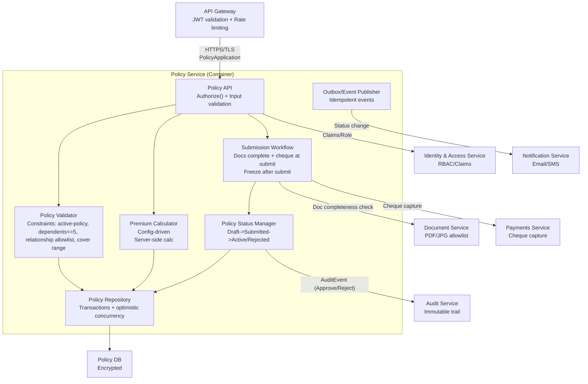
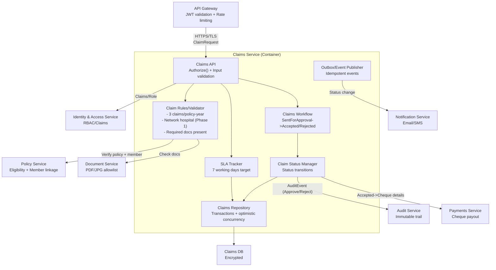
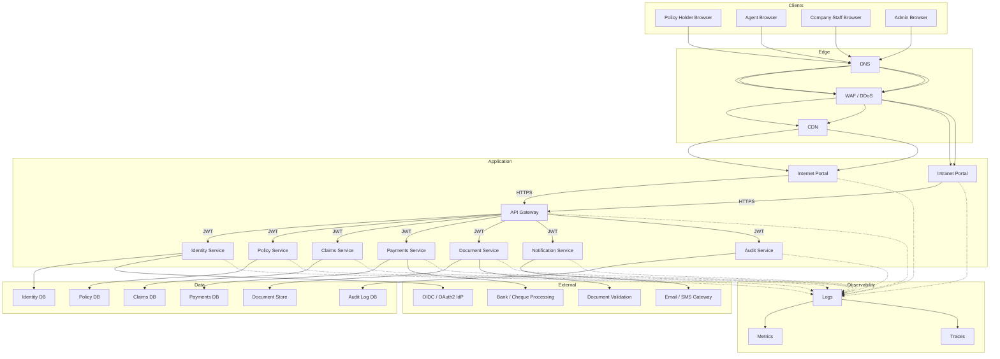
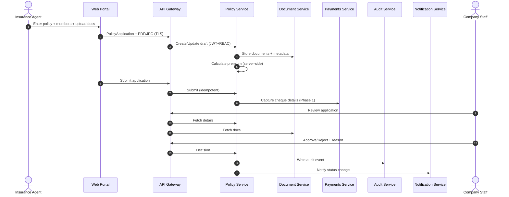
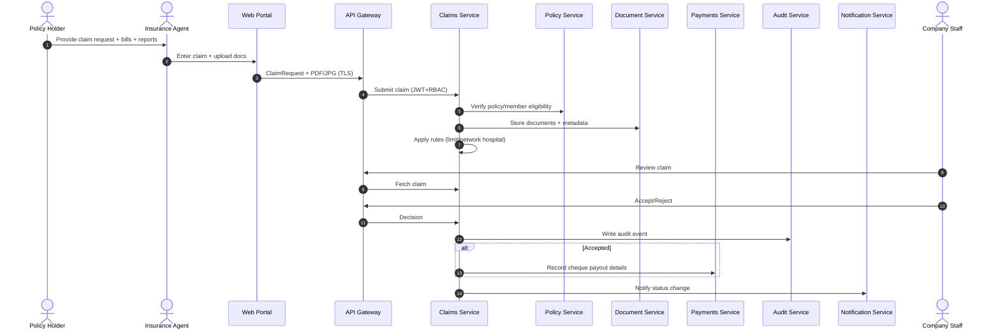
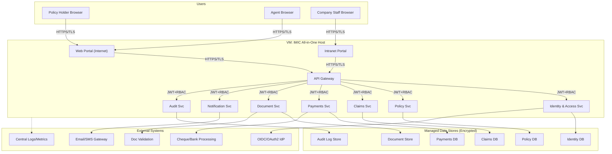
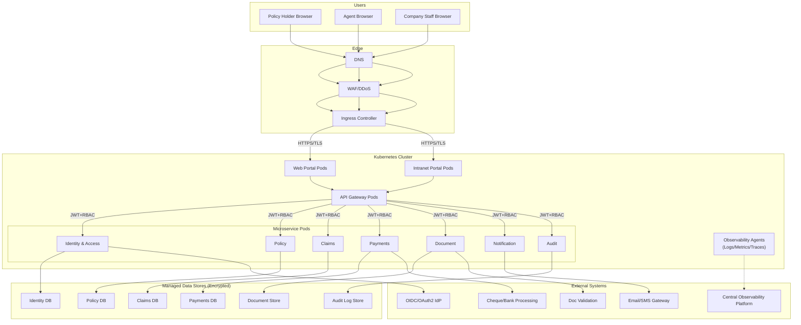
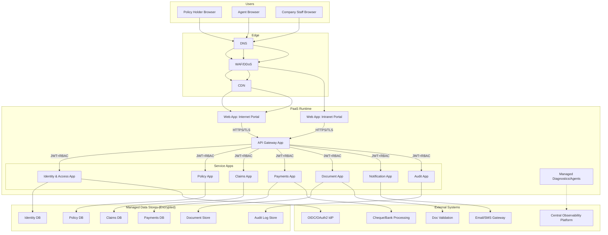

# IMIC – C4 Architecture Pack (Consolidated)

This document merges the **six uploaded C4 markdown files** into **one GitHub-compatible Markdown** and fixes:
- escaped Markdown that breaks headings/lists,
- Mermaid edge-labels broken across lines,
- malformed tables (decision matrix/cost/trade-offs),
- and private Unicode/citation artifacts that can break GitHub rendering.

## Table of Contents
1. [C4 Context/Container/Component/Deployment + Data Flows](#c4-model---system-context-container-component--deployment-imic)
2. [Container Responsibilities & Key Flows (Supplement)](#container-responsibilities--key-flows-supplement)
3. [Component-Level Security Controls (Supplement)](#component-level-security-controls-supplement)
4. [Deployment Variants](#8-deployment-variants-same-c4-semantics)
5. [Decision Matrix & Cost Comparison](#9-deployment-variant-decision-matrix-with-cost-comparison)
6. [Trade-offs](#10-variant-trade-offs-what-you-gain-vs-what-you-pay)
7. [GitHub Rendering Notes](#github-rendering-notes)

---

# C4 Model - System Context, Container, Component & Deployment (IMIC)

This document provides **C4 System Context (L1)**, **C4 Container (L2)**, **C4 Component (L3)**, and **C4 Deployment (L4)** views for the IMIC platform.
It embeds **security controls** and **data flows** directly into the diagrams.
## 1. Scope & Inputs

- IMIC supports **Policy Holder** and **Agent** users via an Internet-facing portal, and **Company Staff** via an intranet portal.
- Core business behaviors include:
  - Policy purchase via Agent
  - Policy approval or rejection by Company Staff
  - Claim submission via Agent
  - Claim processing by Company Staff
- The platform follows a **microservices-based architecture** with:
  - API Gateway
  - independently deployable domain services
  - separate databases per service
  - centralized observability and security controls

> **Note**  
> The deployment view described later is a *reference architecture*. Deployment **variants** (VM, Kubernetes, PaaS) are documented separately.

## 3. C4 - Container (Level 2) with Security + Data Flows



---
## 4. C4 - Component (Level 3)
### 4.1 Policy Service - Component Diagram (with Security + Data Flow)


### 4.2 Claims Service - Component Diagram (with Security + Data Flow)



---
## 5. C4 – Deployment (Level 4) with Security + Data Flow



### Deployment Security Controls (Minimum)
- **Perimeter**: WAF/DDoS protection and restricted ingress rules
- **Transport**: TLS for all inbound and outbound traffic
- **Identity**: OIDC/OAuth2 with JWT validation at the gateway
- **Data**: Encryption at rest for databases and document storage
- **Observability**: Centralized logs, metrics, and traces

## 6. End-to-End Data Flows (Supplementary)
### 6.1 Policy Purchase & Approval - Data Flow


### 6.2 Claim Submission & Processing - Data Flow



---

---

## Container Responsibilities & Key Flows (Supplement)

### Container Notes (Responsibilities)
- **Internet Web Portal**: UI for Policy Holder and Agent; Policy Holder is read-only; Agent performs create/submit operations.
- **Intranet Portal**: UI for Company Staff approvals and System Admin operations (e.g., unlock accounts).
- **API Gateway**: Central routing; validates JWT/claims; rate limiting; request correlation.
- **Identity & Access Service**: lockout policy, manual unlock workflow, RBAC.
- **Policy Service**: policy applications, member/dependent constraints, premium calculation.
- **Claims Service**: claim submission, queueing, status transitions, SLA tracking.
- **Payments Service**: cheque capture at submission; cheque details for claim payouts.
- **Document Service**: PDF/JPG upload, storage, retrieval; integrates with validation.
- **Notification Service**: sends status change notifications (email & SMS) and security alerts.
- **Audit Service**: immutable audit trail for approve/reject actions and admin operations.

## 4. Key Flows (Cross-Container)
### 4.1 Policy Purchase & Approval
1. **Agent** uses Web Portal → API Gateway → Policy Service to create application and upload documents via Document Service.
2. Policy Service requests premium calculation; Payment Service captures cheque details at submission time.
3. Company Staff uses Intranet Portal → API Gateway → Policy/Document services to validate and approve/reject.
4. Notifications sent via Notification Service (Email/SMS).
### 4.2 Claim Submission & Processing
1. Policy Holder provides documents to Agent.
2. Agent uses Web Portal → Claims Service to submit claim with documents.
3. Company Staff processes claim; Payments Service records cheque details for accepted claim.
4. Policy Holder tracks claim status (read-only) via Web Portal.

## 5. Security & Compliance View (Container-level)
- Enforce **RBAC** at Gateway + Services.
- Apply **lockout policy** and **manual unlock** via Identity & Access Service.
- Encrypt **in transit** (TLS) and **at rest** (DB + document store).
- Audit **approve/reject** actions and admin operations.

---

## Component-Level Security Controls (Supplement)

### 4.2 Security Controls Summary (C4 Component)
- **Authentication**: API Gateway validates JWT (OIDC/OAuth2) before reaching Policy API.
- **Authorization**: Policy API enforces RBAC/claims; Agent-only operations and read-only for Policy Holder.
- **Input validation**: Policy API validates payloads; Document Service restricts uploads to PDF/JPG.
- **Integrity & non-repudiation**: Approve/reject and submissions are recorded in Audit Service; repository enforces immutability post-submission.
- **Confidentiality**: TLS in transit; Policy DB encrypted at rest.

---

## 8. Deployment Variants (Same C4 Semantics)

This section provides **three deployment variants** for the *same* logical containers (Portals, API Gateway, Microservices, Data Stores, Observability).
Choose the variant based on scale, ops maturity, and cost.
### 8.1 Variant A — All-in-One VM (Single Host + Managed DB)

**When to use**: PoC, training, small pilot, simplest ops.



**Security controls**
- TLS everywhere; host hardening; OS patching; least-privilege service accounts.
- Gateway enforces JWT validation and rate limiting.
- Datastores encrypted at rest.

---
### 8.2 Variant B — Kubernetes (AKS/EKS/GKE) + Managed Data

**When to use**: scale-out, resilience, frequent releases, strong platform ops.



**Security controls**
- TLS ingress + mTLS service-to-service (recommended).
- Network policies between namespaces; pod security standards.
- Secrets in managed secret store; rotation.
- HPA for resilience; rate limiting at gateway/ingress.

---
### 8.3 Variant C — App Service / PaaS (Web Apps + Container Apps) + Managed Data

**When to use**: fast delivery with managed runtime; reduced cluster ops; moderate scale.



**Security controls**
- TLS termination at edge; private endpoints to data stores (recommended).
- Managed identity to access data/secret stores.
- Gateway rate limiting + WAF rules.

---
### 8.4 Variant Selection Guidance (Quick)
- **All-in-One VM**: lowest ops maturity, fastest PoC, least scalable.
- **Kubernetes**: best for high scale + resilience + frequent deployments, highest ops complexity.
- **App Service/PaaS**: balanced; strong managed capabilities with simpler ops than K8S.

---

## 9. Deployment Variant Decision Matrix (with Cost Comparison)

This matrix helps select between **All-in-One VM**, **Kubernetes**, and **App Service/PaaS** deployment variants while keeping the same C4 semantics (portals + gateway + services + data + observability).
### 9.1 Decision Matrix (Qualitative)

**Legend**: 1 = Poor/Low, 3 = Medium, 5 = Best/High

| Criterion | All-in-One VM | Kubernetes (AKS/EKS/GKE) | App Service / PaaS |
|---|---:|---:|---:|
| Time-to-market / setup speed | 5 | 3 | 4 |
| Operational complexity | 2 | 1 | 4 |
| Scalability (horizontal) | 2 | 5 | 4 |
| Resilience / self-healing | 2 | 5 | 4 |
| Deployment frequency support (CI/CD, blue-green) | 3 | 5 | 4 |
| Observability & diagnostics maturity | 3 | 5 | 4 |
| Security controls maturity (network segmentation, policy, mTLS) | 2 | 5 | 4 |
| Cost predictability | 4 | 3 | 4 |
| Best fit (Phase-1 IMIC training/pilot) | 5 | 3 | 4 |
| Best fit (Enterprise scale / long term) | 2 | 5 | 4 |
### 9.2 Cost Comparison (Relative, with Assumptions)

> **Important**: Exact cost depends heavily on cloud provider, region, sizing, traffic, storage, and HA targets. The comparison below is **relative** to guide decision-making.

**Shared cost drivers across all variants**
- Managed databases (Identity/Policy/Claims/Payments) and document storage.
- Observability (logs/metrics/traces ingestion and retention).
- Egress costs for email/SMS providers and any external integrations.

**Assumptions for comparison (example sizing)**
- Phase-1 target: ~200 concurrent users normal load, ~500 peak sessions.
- 7 microservices + gateway + 2 portals.
- Managed DB per service, encrypted at rest.
- Logs retained for operational troubleshooting (short), audit logs retained longer.

| Cost Dimension | All-in-One VM | Kubernetes (AKS/EKS/GKE) | App Service / PaaS |
|---|---|---|---|
| Compute baseline | **Low–Medium** (1–2 VMs) | **Medium–High** (cluster nodes + control plane) | **Medium** (app plans / consumption)
| Ops/Run cost (people) | **Low** | **High** (platform engineering) | **Medium–Low**
| Scaling cost | **Step-wise** (resize VM) | **Elastic** (HPA + nodes) but can be **higher** | **Elastic** (scale units) moderate
| Availability cost (HA) | **High** (multi-VM + LB) | **Medium** (multi-zone nodes) | **Medium** (multi-instance + zone)
| Networking/Ingress | **Low** | **Medium** (ingress, LB, NAT) | **Low–Medium**
| Observability ingestion | Similar across variants | Similar across variants | Similar across variants
| Typical total (relative) | **$** | **$$$** | **$$** |

**Rule of thumb**
- Choose **All-in-One VM** when you prioritize *lowest platform cost and simplest operations* and can tolerate limited elasticity.
- Choose **Kubernetes** when you prioritize *maximum scalability, resilience, and fine-grained controls*, and you have platform ops maturity/budget.
- Choose **App Service/PaaS** when you want *good scalability/resilience with lower ops overhead* than Kubernetes.
### 9.3 Recommendation Path (Simple)

| If you need... | Prefer |
|---|---|
| Fast PoC / training environment | All-in-One VM |
| Enterprise-grade scale, multi-team microservices, frequent releases | Kubernetes |
| Managed platform with strong baseline security and simpler ops | App Service / PaaS |

---

## 10. Variant Trade-offs (What You Gain vs What You Pay)

This section captures the **primary trade-offs** for each deployment variant, focusing on scalability, reliability, security posture, operational burden, and cost characteristics.
### 10.1 Variant A — All-in-One VM (Single Host)

**Best for**: PoC / training / small pilot, where simplicity and speed matter most.

**Trade-offs**
- ✅ **Simplicity**: Single host is easy to understand, deploy, and troubleshoot.
- ✅ **Lowest platform overhead**: No cluster control-plane or orchestrator to run.
- ✅ **Predictable baseline cost**: Fixed-size VM(s) makes spend predictable.
- ⚠️ **Limited elasticity**: Scaling is mostly vertical (bigger VM) or manual multi-VM.
- ⚠️ **Resilience risk**: Single host is a single point of failure unless HA is added (which increases cost/complexity).
- ⚠️ **Security blast radius**: A compromise/misconfiguration can impact many components because they co-reside.
- ⚠️ **Change risk**: Deployments can be more “big bang” unless you build strong release automation.

**Mitigations**
- Add a second VM and load balancer for HA; separate services into processes/containers; harden OS, patch regularly; restrict ports; enforce backups and disaster recovery runbooks.

---
### 10.2 Variant B — Kubernetes (AKS/EKS/GKE)

**Best for**: Enterprise scale, multi-team delivery, frequent releases, and strong resilience.

**Trade-offs**
- ✅ **Maximum scalability**: Horizontal scaling (HPA) and node pool scaling are first-class.
- ✅ **Resilience & self-healing**: Pods restart, re-schedule, and roll during upgrades.
- ✅ **Strong isolation controls**: Namespace boundaries, network policies, pod security standards, and (optionally) service mesh for mTLS.
- ✅ **Modern delivery**: Blue/green, canary, progressive delivery patterns are natural.
- ⚠️ **Highest operational complexity**: Requires platform engineering skills (cluster ops, upgrades, networking, ingress, policies).
- ⚠️ **Cost overhead**: Cluster baseline (nodes + supporting components) can be higher even at low load.
- ⚠️ **Security is powerful but non-trivial**: Misconfigured RBAC/network policies/ingress can create gaps.

**Mitigations**
- Use managed Kubernetes; standardize helm charts; implement policy-as-code (OPA/Gatekeeper), secrets management, and automated cluster upgrades; introduce service mesh only when needed.

---
### 10.3 Variant C — App Service / PaaS (Web Apps + Managed Services)

**Best for**: Balanced approach—good scalability and resilience with reduced ops burden.

**Trade-offs**
- ✅ **Reduced operational burden**: Managed runtime (patching, scaling primitives, basic health management).
- ✅ **Fast delivery**: Easier to provision and run than Kubernetes.
- ✅ **Good scale for many workloads**: Horizontal scaling via instances; supports staged deployments.
- ✅ **Security baseline**: Managed identity + private endpoints are commonly available patterns.
- ⚠️ **Less control than Kubernetes**: Network-level micro-segmentation and custom scheduling are limited.
- ⚠️ **Platform constraints**: Runtime limits, supported networking patterns, and extension models may constrain advanced scenarios.
- ⚠️ **Cost at sustained high load**: Can become expensive if you need many always-on instances.

**Mitigations**
- Use private endpoints to data; apply gateway/WAF policies; use multiple app plans for isolation; adopt async messaging for spikes; monitor scale-out thresholds carefully.

---
### 10.4 Summary of Trade-offs (One View)

| Dimension | All-in-One VM | Kubernetes | App Service / PaaS |
|---|---|---|---|
| Speed to start | Fastest | Medium | Fast |
| Operational burden | Low | High | Medium-Low |
| Scalability ceiling | Low-Medium | Highest | High |
| Resilience | Low unless HA added | Highest | High |
| Security isolation | Low | Highest | High |
| Typical cost curve | Low baseline, step-wise | Higher baseline, elastic | Medium baseline, elastic |

---

## GitHub Rendering Notes

- Keep each Mermaid diagram inside a fenced block: ` ```mermaid ... ``` `.
- Do not split Mermaid edge labels across lines; use `A -->|"label"| B`.
- Avoid non-standard/private Unicode characters in Markdown (can cause Mermaid parse errors).

## References
- Source files merged: 
  - IMIC_C4_Context_Container_Component_Deployment_DataFlows.md
  - IMIC_C4_System_Context_Container_Component.md
  - IMIC_C4_System_Context_and_Container_1.md
  - IMIC_C4_Context_Container_Component_Deployment_DataFlows_Variants.md
  - IMIC_C4_Context_Container_Component_Deployment_DataFlows_Variants_DecisionMatrix.md
  - IMIC_C4_Context_Container_Component_Deployment_DataFlows_Variants_DecisionMatrix_Tradeoffs.md
