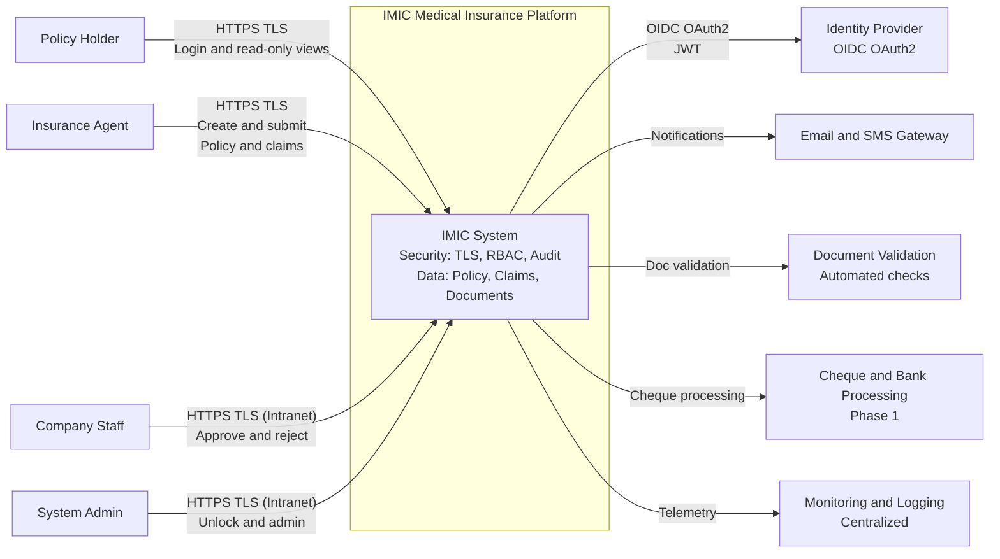
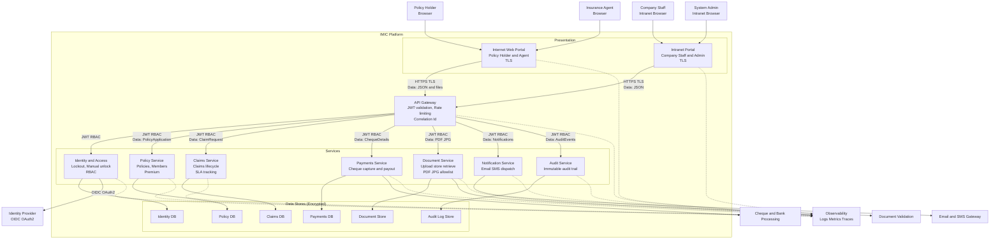
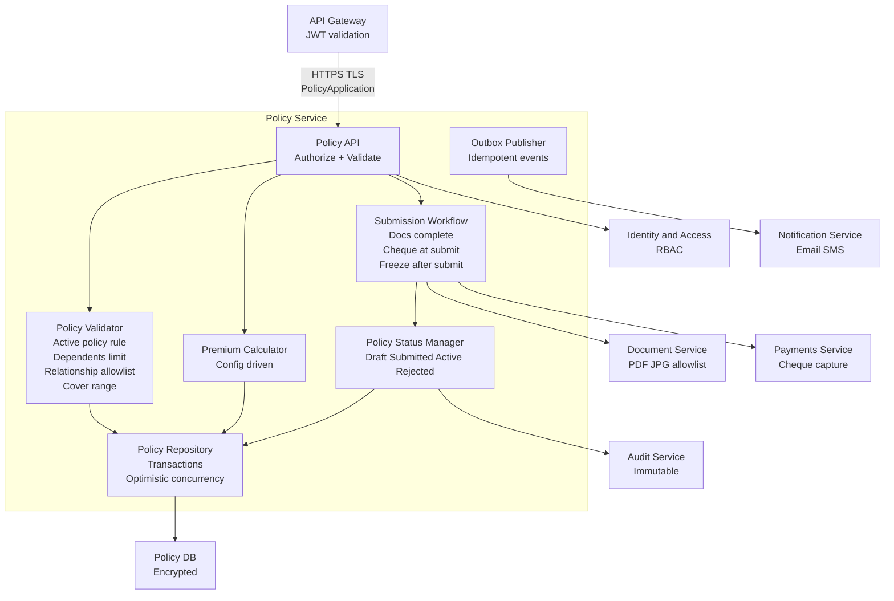
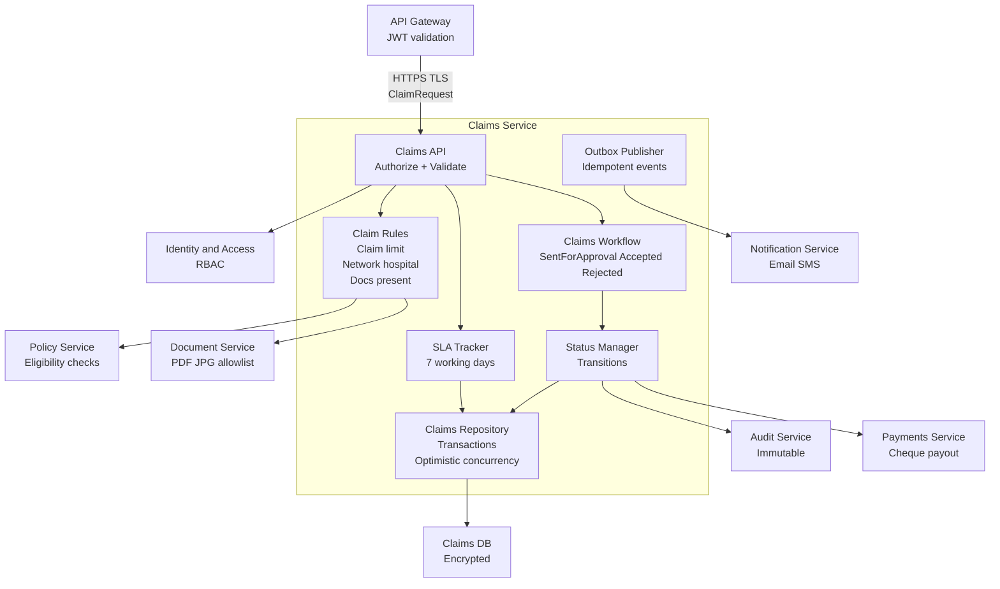
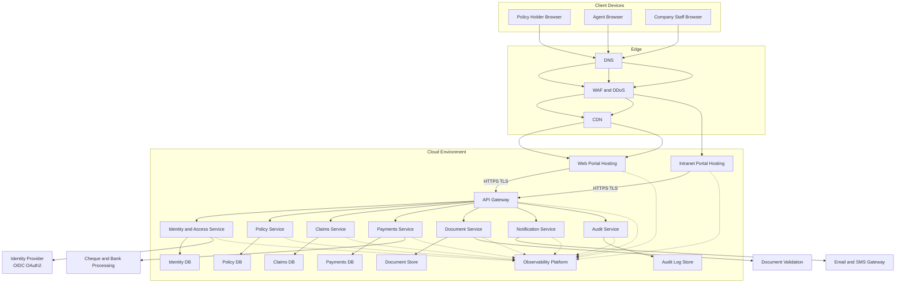
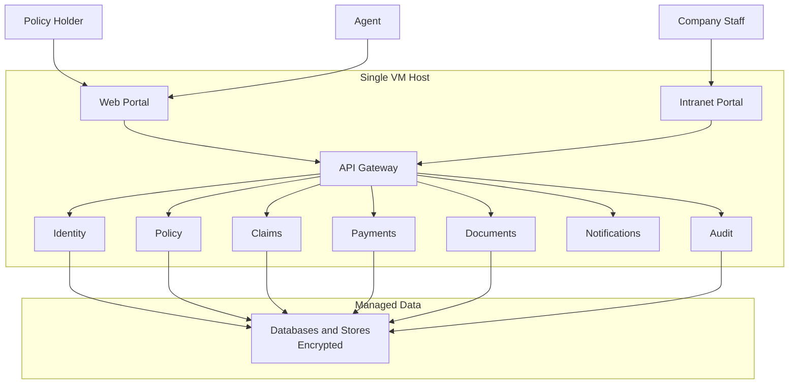
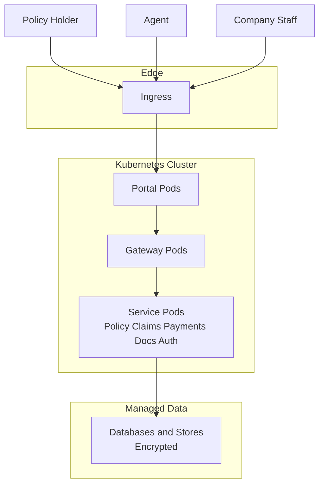
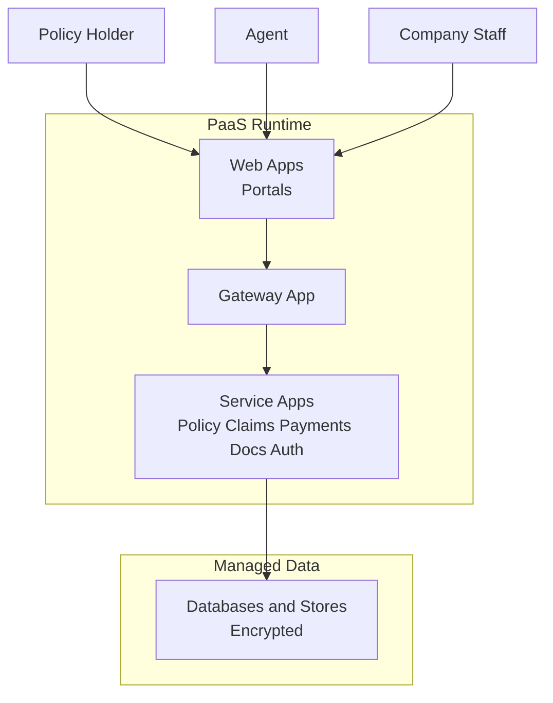
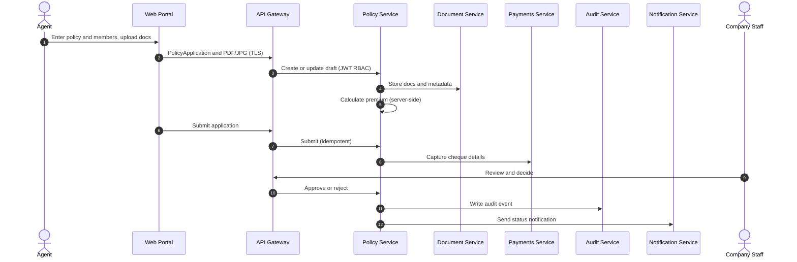
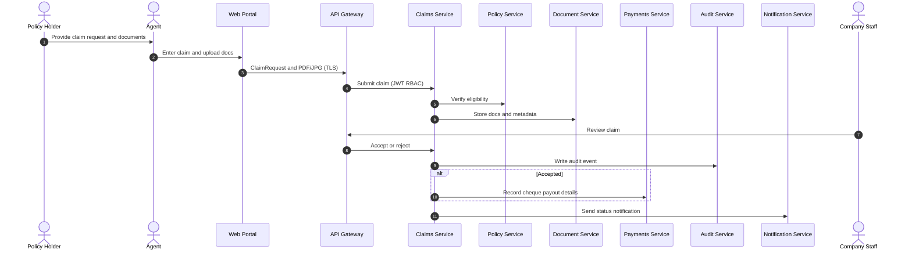

# IMIC - Consolidated C4 Architecture Pack (Context, Container, Component, Deployment)

This is a **single, GitHub-compatible** consolidated document that combines the content from the following C4-related artifacts in the repository (and fixes common Mermaid/GitHub rendering issues):

- IMIC_C4_Context_Container_Component_Deployment_DataFlows.mdturn20search87
- IMIC_C4_Context_Container_Component_Deployment_DataFlows_Variants_DecisionMatrix.mdturn20search87
- IMIC_C4_Context_Container_Component_Deployment_DataFlows_Variants_DecisionMatrix_Tradeoffs.mdturn20search87
- IMIC_C4_GitHub_Safe_Clean.mdturn20search87
- IMIC_C4_System_Context_Container_Component.mdturn21search92
- IMIC_C4_System_Context_and_Container.mdturn21search92

> **Why a consolidated version?** GitHub renders Mermaid diagrams only if each `mermaid` fenced block parses successfully; a single syntax issue can stop a diagram from rendering.turn20search87turn20search88

---

## Table of Contents

- [1. Scope & Assumptions](#1-scope--assumptions)
- [2. C4 System Context (L1)](#2-c4-system-context-l1)
- [3. C4 Container (L2)](#3-c4-container-l2)
- [4. C4 Component (L3)](#4-c4-component-l3)
  - [4.1 Policy Service Components](#41-policy-service-components)
  - [4.2 Claims Service Components](#42-claims-service-components)
- [5. C4 Deployment (L4) - Reference](#5-c4-deployment-l4---reference)
- [6. Deployment Variants](#6-deployment-variants)
  - [6.1 Variant A - All-in-One VM](#61-variant-a---all-in-one-vm)
  - [6.2 Variant B - Kubernetes](#62-variant-b---kubernetes)
  - [6.3 Variant C - App Service / PaaS](#63-variant-c---app-service--paas)
- [7. Decision Matrix & Cost Comparison](#7-decision-matrix--cost-comparison)
- [8. Variant Trade-offs](#8-variant-trade-offs)
- [9. End-to-End Data Flows (Supplementary)](#9-end-to-end-data-flows-supplementary)
- [10. GitHub Mermaid Rendering Checklist](#10-github-mermaid-rendering-checklist)

---

## 1. Scope & Assumptions

- IMIC supports **Policy Holder** and **Agent** via an Internet portal and **Company Staff** via an Intranet portal.turn14search49
- Architecture direction is **cloud-ready**, **microservices-based**, with an **API gateway**, separate databases per service, and observability.turn14search49
- C4 levels follow the standard C4 model hierarchy: Context, Container, Component, Deployment.turn21search92

---

## 2. C4 System Context (L1)



---

## 3. C4 Container (L2)



---

## 4. C4 Component (L3)

### 4.1 Policy Service Components



### 4.2 Claims Service Components



---

## 5. C4 Deployment (L4) - Reference



---

## 6. Deployment Variants

### 6.1 Variant A - All-in-One VM



### 6.2 Variant B - Kubernetes



### 6.3 Variant C - App Service / PaaS



---

## 7. Decision Matrix & Cost Comparison

### 7.1 Decision Matrix (Qualitative)

**Legend**: 1 = Low, 3 = Medium, 5 = High

| Criterion | All-in-One VM | Kubernetes | App Service / PaaS |
|---|---:|---:|---:|
| Time-to-market / setup speed | 5 | 3 | 4 |
| Operational complexity | 2 | 1 | 4 |
| Scalability (horizontal) | 2 | 5 | 4 |
| Resilience / self-healing | 2 | 5 | 4 |
| Deployment frequency support | 3 | 5 | 4 |
| Security isolation controls | 2 | 5 | 4 |
| Cost predictability | 4 | 3 | 4 |

### 7.2 Cost Comparison (Relative)

> Exact cost depends on cloud provider and sizing. This table is **relative**.

| Cost Dimension | All-in-One VM | Kubernetes | App Service / PaaS |
|---|---|---|---|
| Compute baseline | Low to Medium | Medium to High | Medium |
| Ops cost (people) | Low | High | Medium to Low |
| Scaling cost | Step-wise | Elastic, can be higher | Elastic, moderate |
| Availability cost (HA) | High when added | Medium | Medium |
| Typical total (relative) | $ | $$$ | $$ |

---

## 8. Variant Trade-offs

### 8.1 All-in-One VM
- Pros: simplest ops, fast PoC.
- Cons: limited elasticity, larger blast radius, HA increases complexity.

### 8.2 Kubernetes
- Pros: best elasticity, resilience, strongest isolation.
- Cons: highest platform complexity and baseline cost.

### 8.3 App Service / PaaS
- Pros: balanced ops, good scale, managed runtime.
- Cons: less control than Kubernetes, can cost more at sustained high scale.

---

## 9. End-to-End Data Flows (Supplementary)

### 9.1 Policy Purchase and Approval



### 9.2 Claim Submission and Processing



---

## 10. GitHub Mermaid Rendering Checklist

1. Mermaid diagrams must be inside fenced blocks that start with ` ```mermaid ` and end with ` ``` `.turn20search87
2. Avoid reserved-word pitfalls in flowcharts (e.g., avoid lowercase node ids like `end`); use `END` or different ids.turn20search88
3. Do not use sequence-only syntax (e.g., `note over`) inside flowcharts; use `%%` comments instead.turn20search87
4. Third-party Mermaid browser plugins can conflict with GitHub rendering.turn20search87

---

## Sources
- GitHub Docs: Creating diagrams (Mermaid fenced blocks).turn20search87
- Mermaid Docs: Flowchart syntax and reserved words.turn20search88
- C4 Model overview.turn21search92
- Repository architecture overview (microservices, gateway, observability, security).turn14search49
