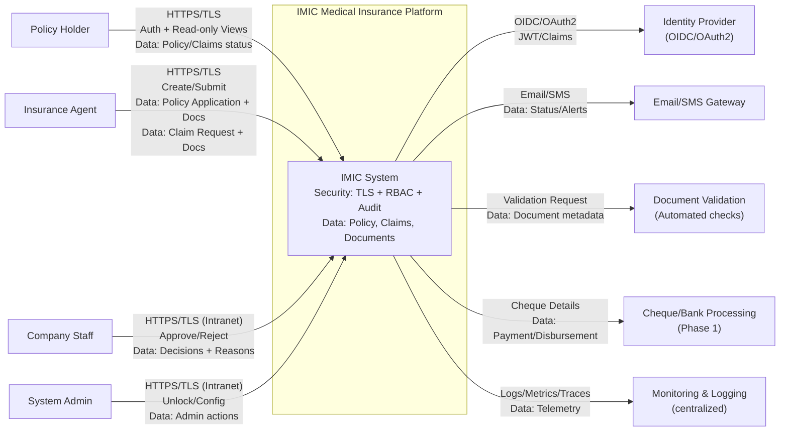
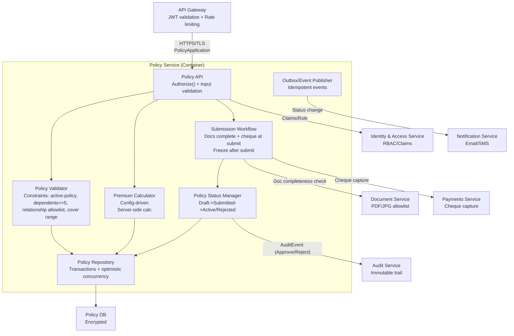
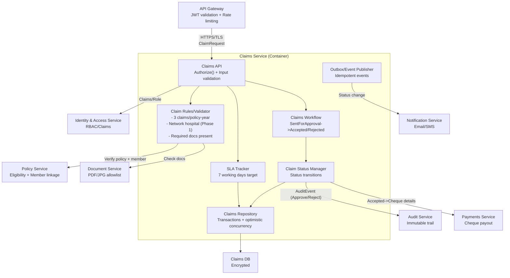
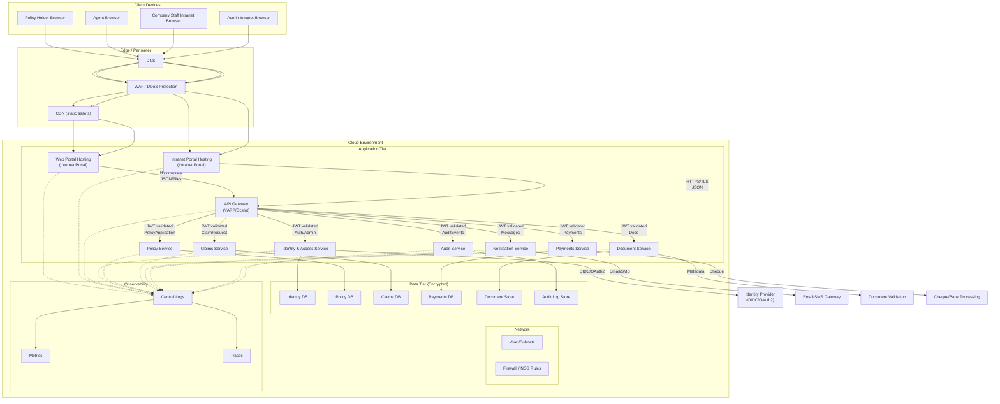
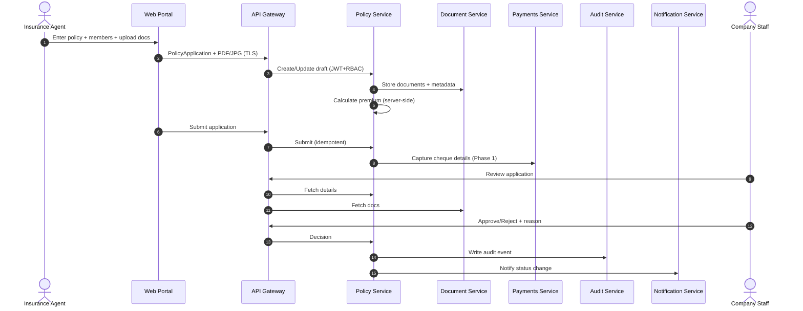
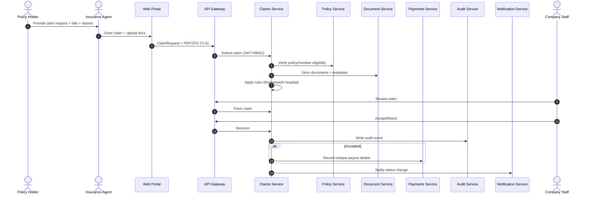

# C4 Model - System Context, Container, Component & Deployment (IMIC)

This document provides **C4 System Context (L1)**, **C4 Container (L2)**, **C4 Component (L3)**, and **C4 Deployment (L4)** views for the IMIC platform.
It embeds **security controls** and **data flows** directly into the diagrams.

## 1. Scope & Inputs
- IMIC supports **Policy Holder** and **Agent** via an internet portal and **Company Staff** via an intranet portal. citeturn1search1
- Core behaviors include policy purchase via agent, company approval/rejection, and claim lifecycle (submission via agent, processing by company). citeturn1search1
- The repository describes a **microservices-based architecture**, a **gateway**, and **separate databases per service**, plus observability and security capabilities. citeturn14search49

> Note: Deployment details below are a **reference deployment** consistent with the repo’s cloud-ready posture and typical enterprise patterns (gateway, services, observability). citeturn14search49

---

## 2. C4 - System Context (Level 1) with Security + Data Flows

---

## 3. C4 - Container (Level 2) with Security + Data Flows

```mermaid
flowchart TB
  %% Users
  PH["Policy Holder\n(Web Browser)"]
  AG["Insurance Agent\n(Web Browser)"]
  CS["Company Staff\n(Intranet Browser)"]
  SA["System Admin\n(Intranet Browser)"]

  %% External
  IDP["Identity Provider\n(OIDC/OAuth2)"]
  MSG["Email/SMS Gateway"]
  DOCV["Document Validation Service"]
  BANK["Cheque/Bank Processing"]
  OBS["Centralized Observability\nLogs/Metrics/Traces"]

  %% IMIC Containers
  subgraph IMIC["IMIC Platform"]

    subgraph UI["Presentation"]
      WEB["Internet Web Portal\n(Policy Holder + Agent)\nSecurity: HTTPS/TLS"]
      INTRA["Intranet Portal\n(Company Staff + Admin)\nSecurity: HTTPS/TLS"]
    end

    GW["API Gateway\nSecurity: JWT validation + Rate limiting\nCorrelation-Id"]

    subgraph SVC["Domain Services (Microservices)"]
      AUTH["Identity & Access Service\nLockout + Manual unlock\nRBAC/Claims"]
      POL["Policy Service\nPolicy applications + Members\nPremium calc"]
      CLM["Claims Service\nClaims lifecycle + SLA tracking"]
      PAY["Payments Service\nCheque capture + payout"]
      DOC["Document Service\nUpload/store/retrieve\nPDF/JPG allowlist"]
      NOTIF["Notification Service\nEmail/SMS dispatch"]
      AUD["Audit Service\nImmutable audit trail"]
    end

    subgraph DATA["Data Stores (Encrypted at Rest)"]
      IDDB["Identity DB"]
      POLDB["Policy DB"]
      CLMDB["Claims DB"]
      PAYDB["Payments DB"]
      DOCSTORE["Document Store\n(Encrypted)"]
      AUDDB["Audit Log Store\n(Write-optimized)"]
    end

  end

  %% User -> UI
  PH --> WEB
  AG --> WEB
  CS --> INTRA
  SA --> INTRA

  %% UI -> Gateway
  WEB -->|"HTTPS/TLS\nData: JSON/Files"| GW
  INTRA -->|"HTTPS/TLS\nData: JSON"| GW

  %% Gateway -> Services (annotate main data)
  GW -->|"JWT+RBAC\nAuth"| AUTH
  GW -->|"JWT+RBAC\nData: PolicyApplication"| POL
  GW -->|"JWT+RBAC\nData: ClaimRequest"| CLM
  GW -->|"JWT+RBAC\nData: ChequeDetails"| PAY
  GW -->|"JWT+RBAC\nData: PDF/JPG docs"| DOC
  GW -->|"JWT+RBAC\nData: Messages"| NOTIF
  GW -->|"JWT+RBAC\nData: AuditEvents"| AUD

  %% Service -> Data
  AUTH --> IDDB
  POL --> POLDB
  CLM --> CLMDB
  PAY --> PAYDB
  DOC --> DOCSTORE
  AUD --> AUDDB

  %% Services -> External
  AUTH -->|"OIDC/OAuth2"| IDP
  NOTIF -->|"Email/SMS"| MSG
  DOC -->|"Metadata + hashes"| DOCV
  PAY -->|"Cheque processing"| BANK

  %% Telemetry
  WEB -.-> OBS
  INTRA -.-> OBS
  GW -.-> OBS
  AUTH -.-> OBS
  POL -.-> OBS
  CLM -.-> OBS
  PAY -.-> OBS
  DOC -.-> OBS
  NOTIF -.-> OBS
  AUD -.-> OBS
```

---

## 4. C4 - Component (Level 3)

### 4.1 Policy Service - Component Diagram (with Security + Data Flow)

### 4.2 Claims Service - Component Diagram (with Security + Data Flow)

---

## 5. C4 - Deployment (Level 4) with Security + Data Flow

> Reference deployment aligned to cloud-ready microservices, API gateway, observability, and security posture described in the repository. citeturn14search49

### Deployment Security Controls (Minimum)
- **Perimeter**: WAF/DDoS and firewall rules; only required ports open.
- **Transport**: TLS for all ingress/egress.
- **Identity**: OIDC/OAuth2 with JWT/claims; lockout enforced by Identity & Access.
- **Data**: encryption at rest for DBs and document store.
- **Observability**: centralized logs/metrics/traces with alerts.

---

## 6. End-to-End Data Flows (Supplementary)

### 6.1 Policy Purchase & Approval - Data Flow

### 6.2 Claim Submission & Processing - Data Flow

---

## 7. References (Project Artifacts)
- Functional use cases: `docs/architecture/ArchitectureRequirementAnalysisDesign/IMIC_Functional_Use_Cases.md` citeturn1search1
- NFR use cases: `docs/architecture/ArchitectureRequirementAnalysisDesign/IMIC_NFR_Use_Cases.md` citeturn1search1
- RTM + STRIDE: `docs/architecture/ArchitectureRequirementAnalysisDesign/IMIC_RTM_STRIDE_Functional_NFR_GitHub.md` citeturn11search1
- Repo architecture overview (microservices/gateway/observability/security): repository README citeturn14search49
