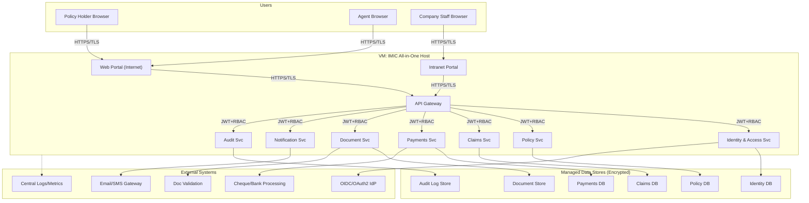
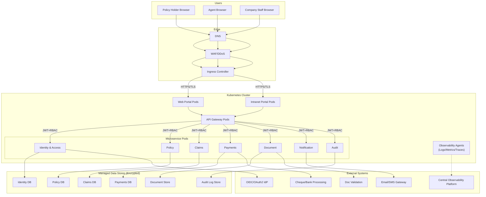
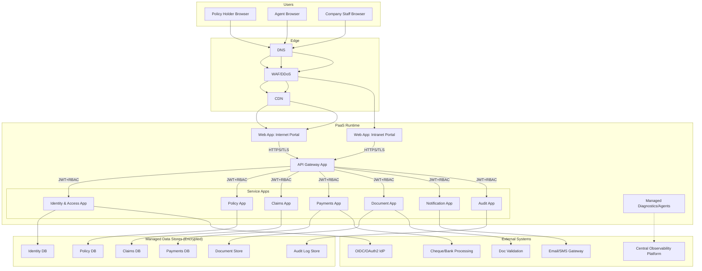

---

## 8. Deployment Variants (Same C4 Semantics)

This section provides **three deployment variants** for the *same* logical containers (Portals, API Gateway, Microservices, Data Stores, Observability).
Choose the variant based on scale, ops maturity, and cost.

### 8.1 Variant A — All-in-One VM (Single Host + Managed DB)

**When to use**: PoC, training, small pilot, simplest ops.

**Security controls**
- TLS everywhere; host hardening; OS patching; least-privilege service accounts.
- Gateway enforces JWT validation and rate limiting.
- Datastores encrypted at rest.

---

### 8.2 Variant B — Kubernetes (AKS/EKS/GKE) + Managed Data

**When to use**: scale-out, resilience, frequent releases, strong platform ops.

**Security controls**
- TLS ingress + mTLS service-to-service (recommended).
- Network policies between namespaces; pod security standards.
- Secrets in managed secret store; rotation.
- HPA for resilience; rate limiting at gateway/ingress.

---

### 8.3 Variant C — App Service / PaaS (Web Apps + Container Apps) + Managed Data

**When to use**: fast delivery with managed runtime; reduced cluster ops; moderate scale.

**Security controls**
- TLS termination at edge; private endpoints to data stores (recommended).
- Managed identity to access data/secret stores.
- Gateway rate limiting + WAF rules.

---

### 8.4 Variant Selection Guidance (Quick)
- **All-in-One VM**: lowest ops maturity, fastest PoC, least scalable.
- **Kubernetes**: best for high scale + resilience + frequent deployments, highest ops complexity.
- **App Service/PaaS**: balanced; strong managed capabilities with simpler ops than K8S.