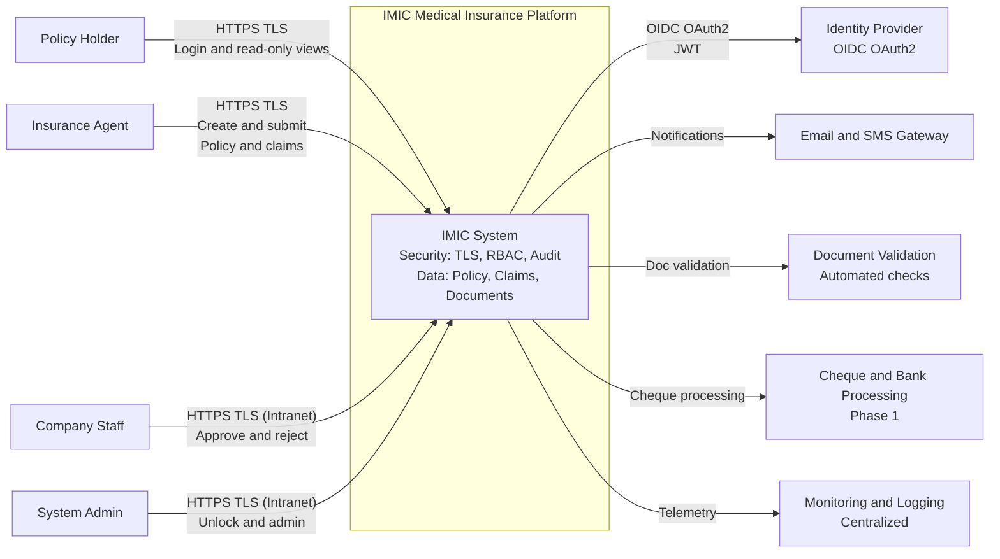
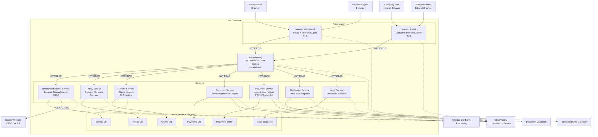
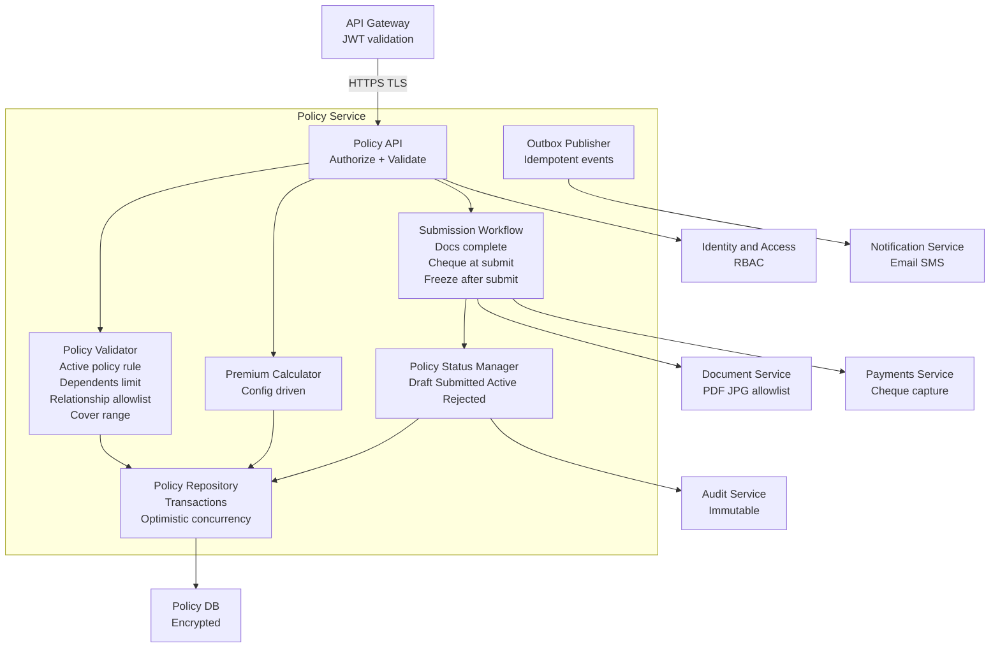
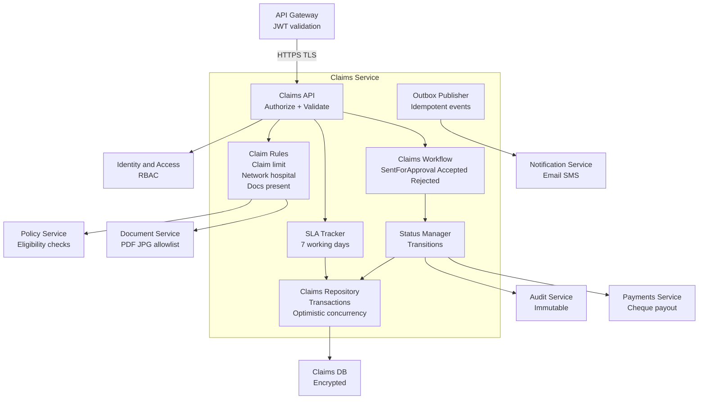
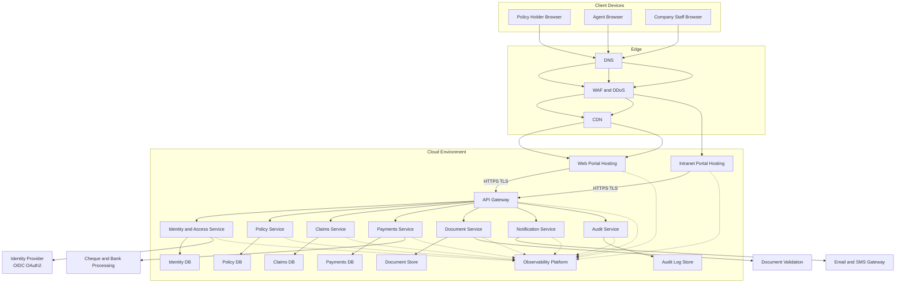
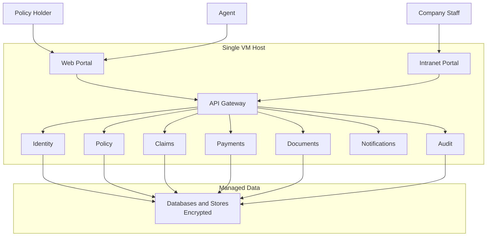
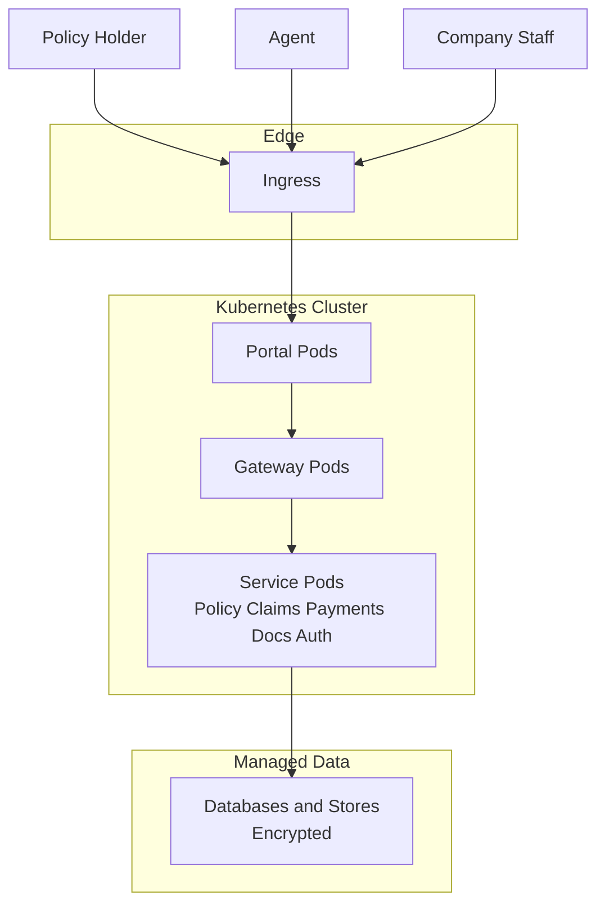
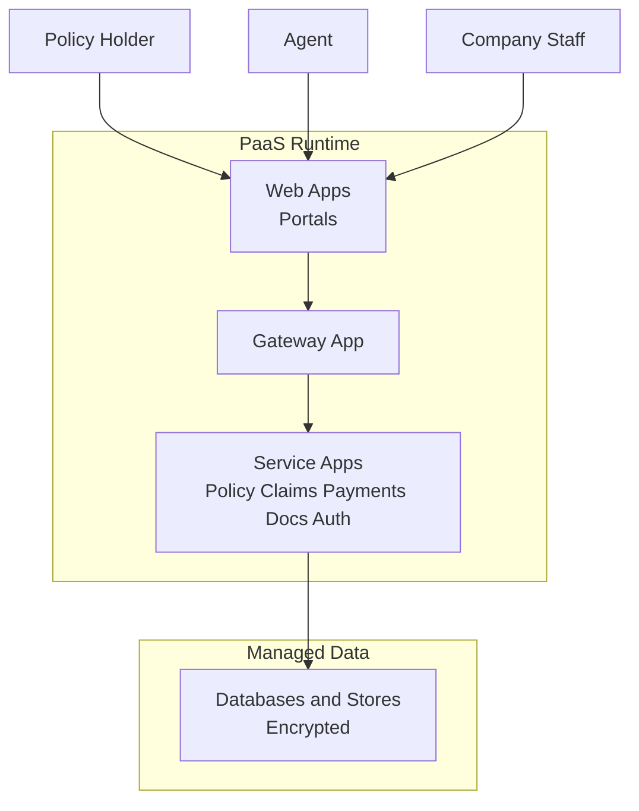

# IMIC - C4 Diagrams (Context, Container, Component, Deployment)

This document is a **GitHub-safe** version of the IMIC C4 diagrams.
It avoids Mermaid edge cases (reserved words, unsupported note syntax in flowcharts, and risky labels) and is intended to render cleanly on GitHub.

> Tip: GitHub can render Mermaid diagrams inside fenced code blocks (` ```mermaid `). You can also check the Mermaid version GitHub uses by running ` ```mermaid\ninfo\n``` ` in a Markdown file. 

---

## 1) C4 System Context (L1)



---

## 2) C4 Container (L2)



---

## 3) C4 Component (L3) - Policy Service



---

## 4) C4 Component (L3) - Claims Service



---

## 5) C4 Deployment (L4) - Reference Deployment



---

## 6) Deployment Variants (VM vs Kubernetes vs App Service)

### 6.1 Variant A - All-in-One VM



### 6.2 Variant B - Kubernetes



### 6.3 Variant C - App Service / PaaS



---

## 7) Why GitHub Rendering Can Fail (Quick Checklist)

1. Ensure every diagram is inside a fenced block that starts with ` ```mermaid ` and ends with ` ``` `. 
2. Validate Mermaid flowcharts for reserved words like `end` (lowercase can break flowcharts). 
3. Avoid putting `note over ...` inside `flowchart` diagrams (notes belong to sequence diagrams). Use comments `%%` inside flowcharts instead. 
4. If you use third-party Mermaid browser plugins, they can conflict with GitHub rendering. 

---

## 8) Next Step
If you paste the **exact GitHub error text** (it usually includes “Parse error on line ...”), I can pinpoint the specific Mermaid block and provide a minimal patch.


## References
- GitHub Docs: Creating diagrams (Mermaid fenced blocks).
- Mermaid Docs: Flowchart syntax and reserved words.
