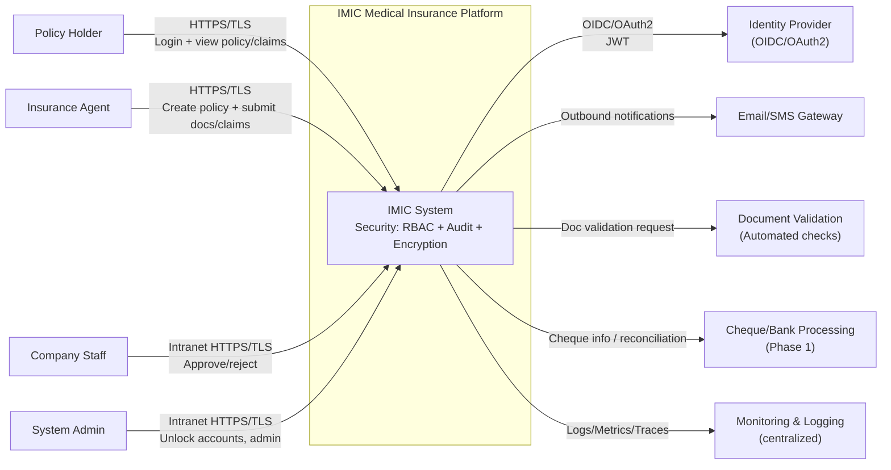
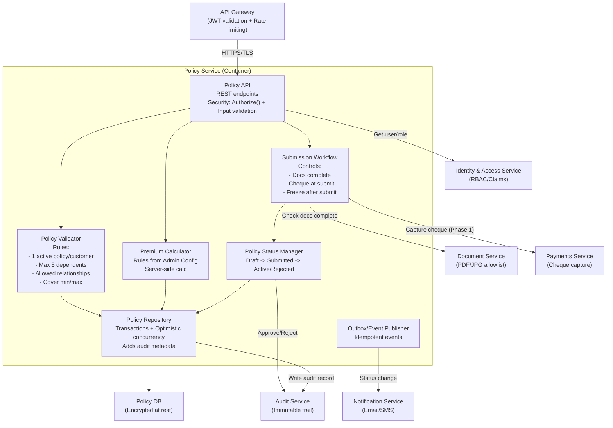

# C4 Model – System Context, Container & Component (IMIC)

This document provides **C4 System Context (L1)**, **C4 Container (L2)**, and **C4 Component (L3)** views for the IMIC platform.
It also annotates **security controls** directly on the diagrams.

## 1. Scope & Assumptions
- **Primary portals**: Internet portal for Policy Holder & Agent, and an Intranet portal for Company Staff.
- **Core journeys**: Policy purchase via Agent; policy approval/rejection by Company; claim submission via Agent; claim approval/rejection by Company; Policy Holder views details read‑only.
- **Security**: Lockout after 3 invalid login attempts and manual reactivation; encryption in transit/at rest; audit logging for approval actions; email/SMS notifications.
- **Architecture style**: Modular microservices with an API Gateway; separate databases per service; observability/monitoring.

> NOTE: Some integrations (e.g., payment gateways) may exist in future releases; Phase‑1 uses cheque-based payment processing.

---

## 2. C4 – System Context Diagram (Level 1)

---

## 3. C4 – Container Diagram (Level 2)

```mermaid
flowchart TB
  %% Users
  PH["Policy Holder\n(Web Browser)"]
  AG["Insurance Agent\n(Web Browser)"]
  CS["Company Staff\n(Intranet Browser)"]
  SA["System Admin\n(Intranet Browser)"]

  %% External
  IDP["Identity Provider\n(OIDC/OAuth2)"]
  MSG["Email/SMS Gateway"]
  DOCV["Document Validation Service"]
  BANK["Cheque/Bank Processing"]
  OBS["Centralized Observability\nLogs/Metrics/Traces"]

  %% IMIC Containers
  subgraph IMIC["IMIC Platform"]

    subgraph UI["Presentation"]
      WEB["Internet Web Portal\n(Policy Holder + Agent)\nSecurity: HTTPS/TLS"]
      INTRA["Intranet Portal\n(Company Staff + Admin)\nSecurity: HTTPS/TLS"]
    end

    GW["API Gateway\nSecurity: JWT validation + Rate limiting\nRequest correlation"]

    subgraph SVC["Domain Services (Microservices)"]
      AUTH["Identity & Access Service\nLockout + Manual unlock\nRBAC/Claims"]
      POL["Policy Service\nPolicies + Members\nPremium calc"]
      CLM["Claims Service\nClaims lifecycle\nStatus tracking"]
      PAY["Payments Service\nCheque capture\nClaim payout cheque"]
      DOC["Document Service\nUpload/store/retrieve\nFile type allowlist"]
      NOTIF["Notification Service\nEmail/SMS dispatch"]
      AUD["Audit Service\nImmutable audit trail"]
    end

    subgraph DATA["Data Stores (Encrypted at Rest)"]
      IDDB["Identity DB"]
      POLDB["Policy DB"]
      CLMDB["Claims DB"]
      PAYDB["Payments DB"]
      DOCSTORE["Document Store\n(Encrypted)"]
      AUDDB["Audit Log Store\n(Write-optimized)"]
    end

  end

  %% User -> UI
  PH --> WEB
  AG --> WEB
  CS --> INTRA
  SA --> INTRA

  %% UI -> Gateway
  WEB -->|"HTTPS/TLS"| GW
  INTRA -->|"HTTPS/TLS"| GW

  %% Gateway -> Services
  GW -->|"JWT + RBAC"| AUTH
  GW -->|"JWT + RBAC"| POL
  GW -->|"JWT + RBAC"| CLM
  GW -->|"JWT + RBAC"| PAY
  GW -->|"JWT + RBAC"| DOC
  GW -->|"JWT + RBAC"| NOTIF
  GW -->|"JWT + RBAC"| AUD

  %% Service -> Data
  AUTH --> IDDB
  POL --> POLDB
  CLM --> CLMDB
  PAY --> PAYDB
  DOC --> DOCSTORE
  AUD --> AUDDB

  %% Services -> External
  AUTH -->|"OIDC/OAuth2"| IDP
  NOTIF --> MSG
  DOC --> DOCV
  PAY --> BANK

  %% Telemetry
  WEB -.-> OBS
  INTRA -.-> OBS
  GW -.-> OBS
  AUTH -.-> OBS
  POL -.-> OBS
  CLM -.-> OBS
  PAY -.-> OBS
  DOC -.-> OBS
  NOTIF -.-> OBS
  AUD -.-> OBS
```

---

## 4. C4 – Component Diagram (Level 3)

> C4 Component is shown for the **Policy Service** container because it is central to onboarding and enforces key business constraints (members/dependents, cover limits, submission immutability) and security/audit controls.

### 4.1 Policy Service – Components (with security controls)

### 4.2 Security Controls Summary (C4 Component)
- **Authentication**: API Gateway validates JWT (OIDC/OAuth2) before reaching Policy API.
- **Authorization**: Policy API enforces RBAC/claims; Agent-only operations and read-only for Policy Holder.
- **Input validation**: Policy API validates payloads; Document Service restricts uploads to PDF/JPG.
- **Integrity & non-repudiation**: Approve/reject and submissions are recorded in Audit Service; repository enforces immutability post-submission.
- **Confidentiality**: TLS in transit; Policy DB encrypted at rest.

---

## 5. References (Project Artifacts)
- Functional use cases: `docs/architecture/ArchitectureRequirementAnalysisDesign/IMIC_Functional_Use_Cases.md`
- NFR use cases: `docs/architecture/ArchitectureRequirementAnalysisDesign/IMIC_NFR_Use_Cases.md`
- RTM + STRIDE: `docs/architecture/ArchitectureRequirementAnalysisDesign/IMIC_RTM_STRIDE_Functional_NFR_GitHub.md`
- Security requirements & use cases: `docs/security/security.md`, `docs/security/security-use-cases.md`
- Security flow diagrams: `docs/security/*`
