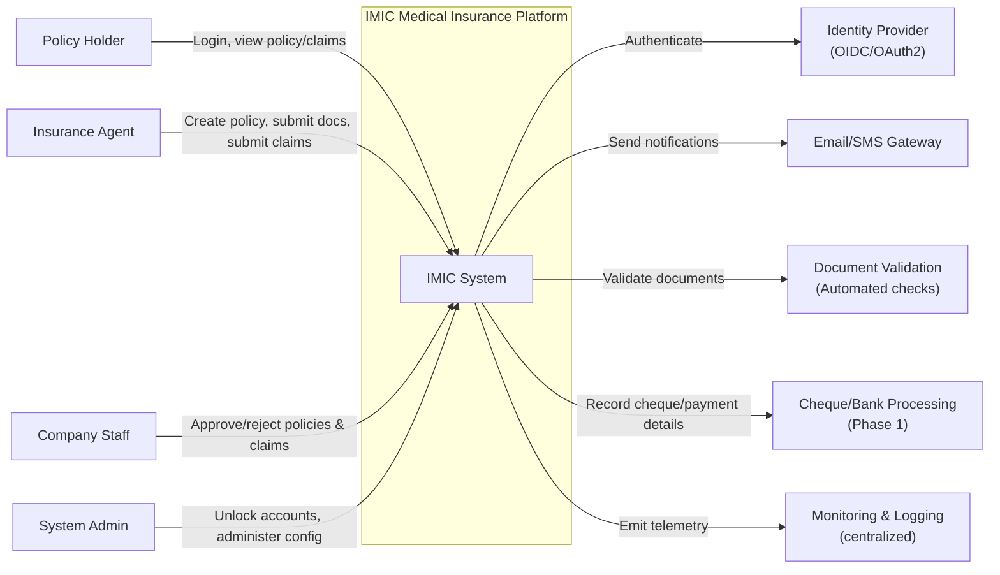

# C4 Model – System Context & Container (IMIC)

This document provides **C4 System Context** and **C4 Container** views for the IMIC platform, derived from the project’s architecture artifacts and requirement/use‑case set.

## 1. Scope & Assumptions
- **Primary portals**: Internet portal for Policy Holder & Agent, and an Intranet portal for Company Staff.
- **Core journeys**: Policy purchase via Agent; policy approval/rejection by Company; claim submission via Agent; claim approval/rejection by Company; Policy Holder views details read‑only.
- **Security**: Lockout after 3 invalid login attempts and manual reactivation; encryption in transit/at rest; audit logging for approval actions; email/SMS notifications.
- **Architecture style**: Modular microservices with an API Gateway; separate databases per service; observability/monitoring.

> NOTE: Some integrations (e.g., payment gateways) may exist in future releases; Phase‑1 uses cheque-based payment processing.

---

## 2. C4 – System Context Diagram (Level 1)

### Context Notes
- The **IMIC System** supports three stakeholder groups: Policy Holder, Agent, and Company Staff.
- **Agents** act as the submission channel for policy applications and claims.
- **Company Staff** validates documents and approves/rejects applications and claims.
- **System Admin** performs manual account reactivation and operational admin functions.

---

## 3. C4 – Container Diagram (Level 2)

```mermaid
flowchart TB
  %% Users
  PH["Policy Holder\n(Web Browser)"]
  AG["Insurance Agent\n(Web Browser)"]
  CS["Company Staff\n(Intranet Browser)"]
  SA["System Admin\n(Intranet Browser)"]

  %% External
  IDP["Identity Provider\n(OIDC/OAuth2)"]
  MSG["Email/SMS Gateway"]
  DOCV["Document Validation Service"]
  BANK["Cheque/Bank Processing"]
  OBS["Centralized Observability\nLogs/Metrics/Traces"]

  %% IMIC Containers
  subgraph IMIC["IMIC Platform"]

    subgraph UI["Presentation"]
      WEB["Internet Web Portal\n(Policy Holder + Agent)"]
      INTRA["Intranet Portal\n(Company Staff + Admin)"]
    end

    GW["API Gateway\n(Routing, Rate Limits, JWT Validation)"]

    subgraph SVC["Domain Services (Microservices)"]
      AUTH["Identity & Access Service\n(User profiles, lockout, roles)"]
      POL["Policy Service\n(Policies, members, premium calc)"]
      CLM["Claims Service\n(Claims lifecycle, statuses)"]
      PAY["Payments Service\n(Cheque capture, reconciliation)"]
      DOC["Document Service\n(Upload, store, retrieval)"]
      NOTIF["Notification Service\n(Email/SMS dispatch)"]
      AUD["Audit Service\n(Immutable audit trail)"]
    end

    subgraph DATA["Data Stores"]
      IDDB["Identity DB"]
      POLDB["Policy DB"]
      CLMDB["Claims DB"]
      PAYDB["Payments DB"]
      DOCSTORE["Document Store\n(Encrypted)"]
      AUDDB["Audit Log Store\n(Write-optimized)"]
    end

  end

  %% User -> UI
  PH --> WEB
  AG --> WEB
  CS --> INTRA
  SA --> INTRA

  %% UI -> Gateway
  WEB --> GW
  INTRA --> GW

  %% Gateway -> Services
  GW --> AUTH
  GW --> POL
  GW --> CLM
  GW --> PAY
  GW --> DOC
  GW --> NOTIF
  GW --> AUD

  %% Service -> Data
  AUTH --> IDDB
  POL --> POLDB
  CLM --> CLMDB
  PAY --> PAYDB
  DOC --> DOCSTORE
  AUD --> AUDDB

  %% Services -> External
  AUTH --> IDP
  NOTIF --> MSG
  DOC --> DOCV
  PAY --> BANK

  %% Telemetry
  WEB -.-> OBS
  INTRA -.-> OBS
  GW -.-> OBS
  AUTH -.-> OBS
  POL -.-> OBS
  CLM -.-> OBS
  PAY -.-> OBS
  DOC -.-> OBS
  NOTIF -.-> OBS
  AUD -.-> OBS
```

### Container Notes (Responsibilities)
- **Internet Web Portal**: UI for Policy Holder and Agent; Policy Holder is read-only; Agent performs create/submit operations.
- **Intranet Portal**: UI for Company Staff approvals and System Admin operations (e.g., unlock accounts).
- **API Gateway**: Central routing; validates JWT/claims; rate limiting; request correlation.
- **Identity & Access Service**: lockout policy, manual unlock workflow, RBAC.
- **Policy Service**: policy applications, member/dependent constraints, premium calculation.
- **Claims Service**: claim submission, queueing, status transitions, SLA tracking.
- **Payments Service**: cheque capture at submission; cheque details for claim payouts.
- **Document Service**: PDF/JPG upload, storage, retrieval; integrates with validation.
- **Notification Service**: sends status change notifications (email & SMS) and security alerts.
- **Audit Service**: immutable audit trail for approve/reject actions and admin operations.

---

## 4. Key Flows (Cross-Container)

### 4.1 Policy Purchase & Approval
1. **Agent** uses Web Portal → API Gateway → Policy Service to create application and upload documents via Document Service.
2. Policy Service requests premium calculation; Payment Service captures cheque details at submission time.
3. Company Staff uses Intranet Portal → API Gateway → Policy/Document services to validate and approve/reject.
4. Notifications sent via Notification Service (Email/SMS).

### 4.2 Claim Submission & Processing
1. Policy Holder provides documents to Agent.
2. Agent uses Web Portal → Claims Service to submit claim with documents.
3. Company Staff processes claim; Payments Service records cheque details for accepted claim.
4. Policy Holder tracks claim status (read-only) via Web Portal.

---

## 5. Security & Compliance View (Container-level)
- Enforce **RBAC** at Gateway + Services.
- Apply **lockout policy** and **manual unlock** via Identity & Access Service.
- Encrypt **in transit** (TLS) and **at rest** (DB + document store).
- Audit **approve/reject** actions and admin operations.

---

## 6. References (Project Artifacts)
> These are the source artifacts in the repository used to derive this C4 view.
- Functional use cases: `docs/architecture/ArchitectureRequirementAnalysisDesign/IMIC_Functional_Use_Cases.md`
- NFR use cases: `docs/architecture/ArchitectureRequirementAnalysisDesign/IMIC_NFR_Use_Cases.md`
- RTM + STRIDE: `docs/architecture/ArchitectureRequirementAnalysisDesign/IMIC_RTM_STRIDE_Functional_NFR_GitHub.md`
- Security requirements & use cases: `docs/security/security.md`, `docs/security/security-use-cases.md`
- Security flow diagrams: `docs/security/*`
