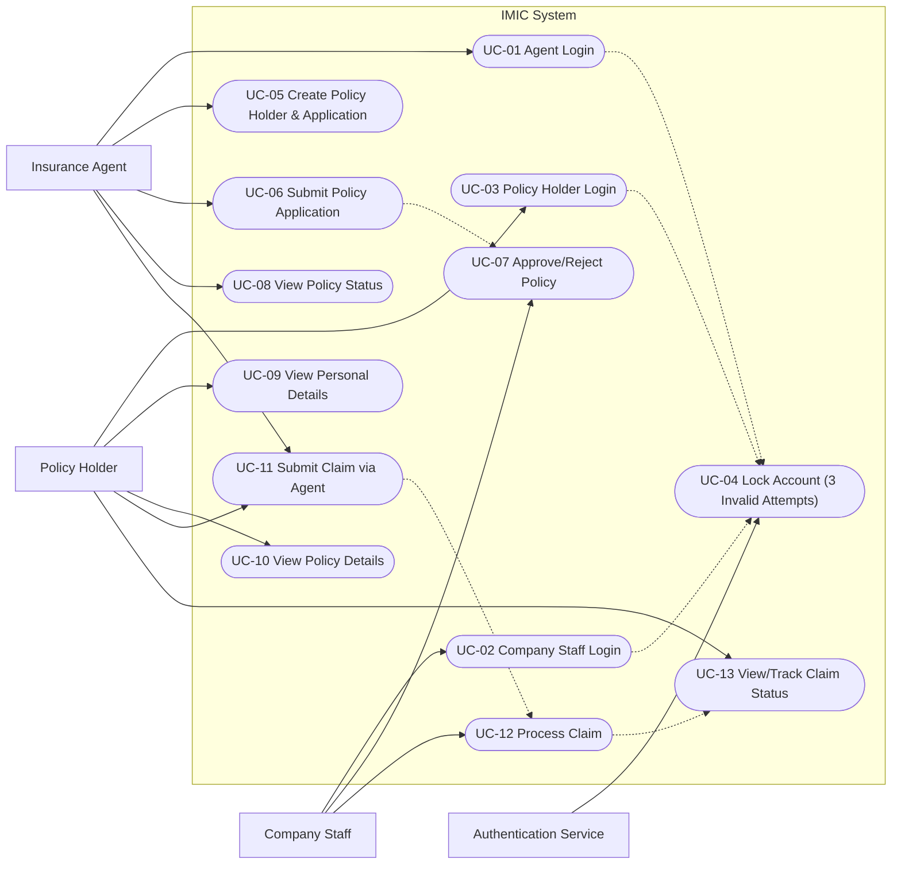
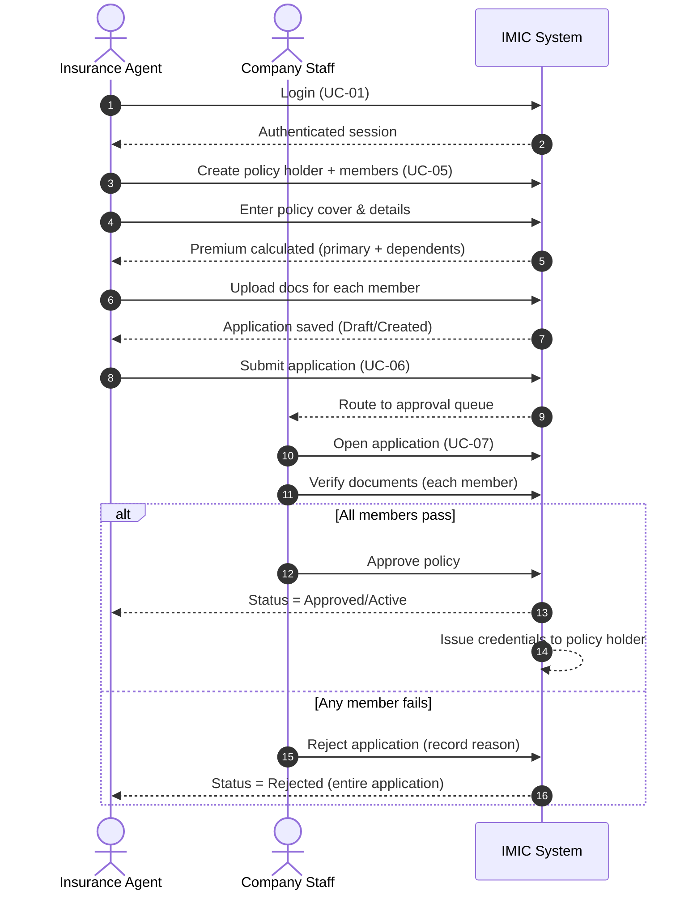
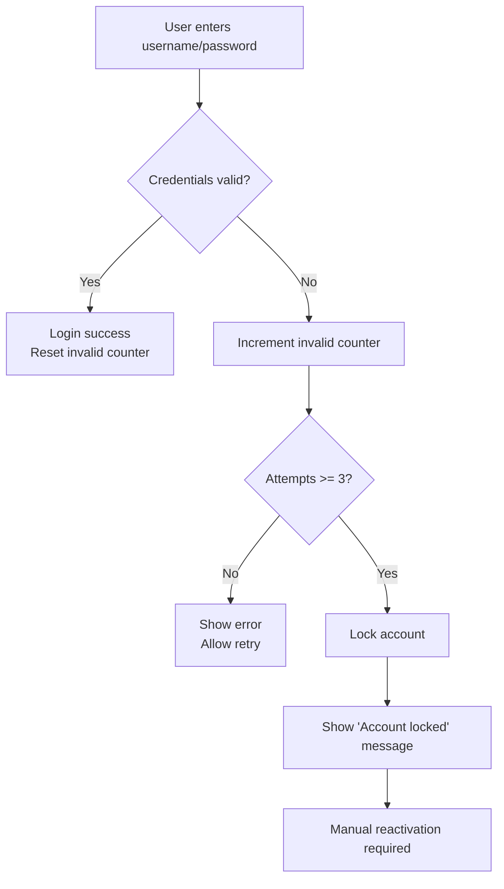

# IMIC – Use Cases (Functional Requirements)

## Mermaid Diagrams

### 1) System Use-Case Diagram (High Level)



---

### 2) UC-05 + UC-06 + UC-07 (Buying a Policy End-to-End)



---

### 3) UC-11 + UC-12 + UC-13 (Claim Lifecycle)

```mermaid
sequenceDiagram
  autonumber
  actor PH as Policy Holder
  actor AG as Insurance Agent
  actor CS as Company Staff
  participant SYS as IMIC System

  note over PH,SYS
    Policy is Active.
    Claim can be raised immediately after issuance.
  end

  PH->>AG: Provide claim request + bills + diagnostic reports
  AG->>SYS: Login (UC-01)
  SYS-->>AG: Authenticated session

  AG->>SYS: Enter claim details (UC-11)
  AG->>SYS: Upload/attach documents
  AG->>SYS: Submit claim
  SYS-->>SYS: Status = Sent for Approval (default)
  SYS-->>CS: Route to claims queue

  CS->>SYS: Review claim + validate docs (UC-12)
  alt Accepted
    CS->>SYS: Enter cheque/payment details
    SYS-->>SYS: Status = Accepted
  else Rejected
    CS->>SYS: Record rejection reason
    SYS-->>SYS: Status = Rejected
  end

  PH->>SYS: Login (UC-03)
  SYS-->>PH: Authenticated session
  PH->>SYS: View Claims Details (UC-13)
  SYS-->>PH: Show all claims + current status
```

---

### 4) UC-01/02/03 + UC-04 (Login With Account Lock Rule)


