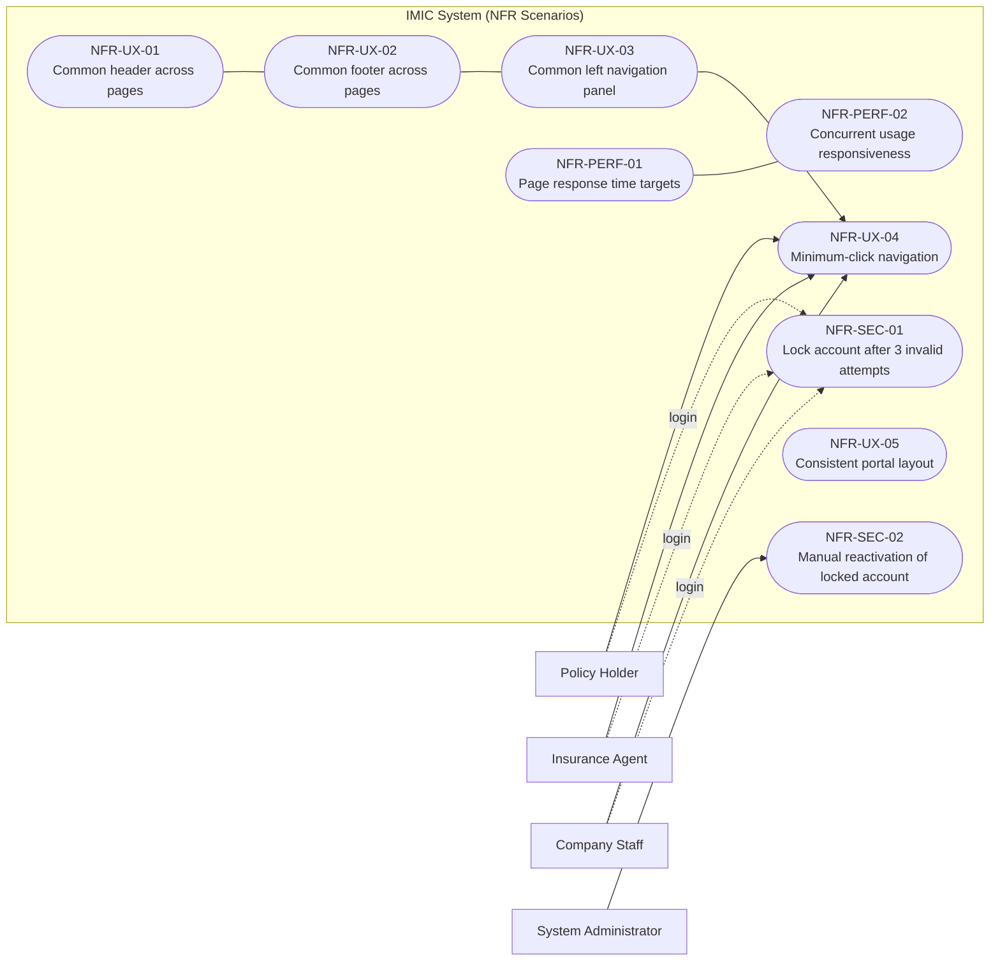
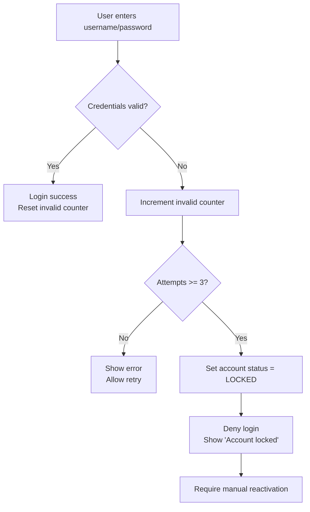
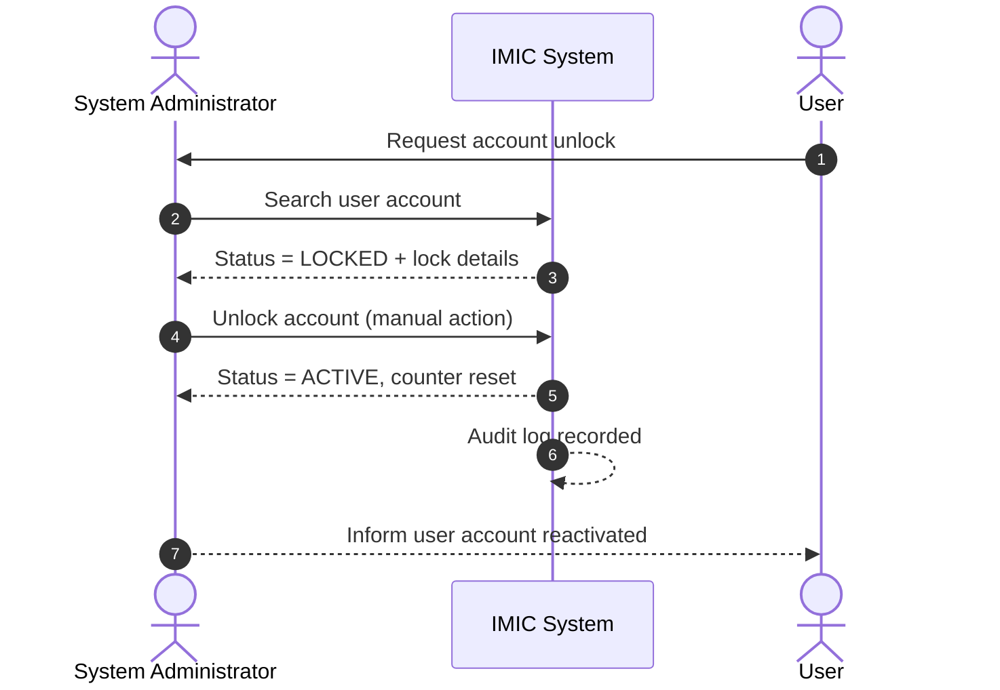
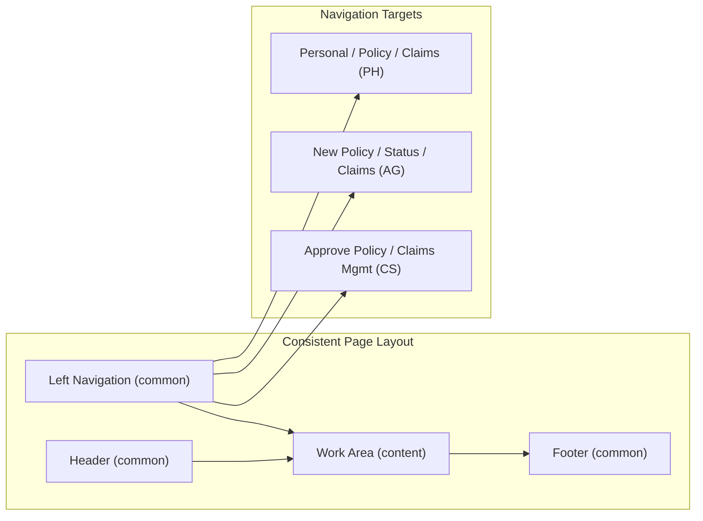
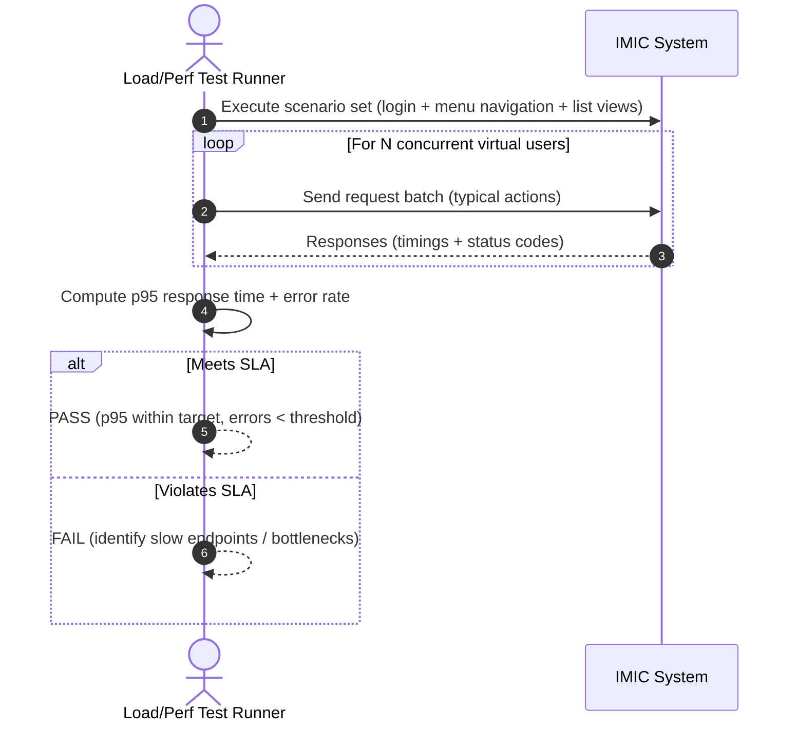

# IMIC – Use Cases (Non-Functional Requirements)

## Mermaid Diagrams

### 1) NFR Coverage Overview (Security, UX, Performance)

---

### 2) NFR-SEC-01 (Account Lockout After 3 Invalid Attempts)

---

### 3) NFR-SEC-02 (Manual Reactivation of Locked Account)

---

### 4) NFR-UX (Common Layout & Minimum-Click Navigation)

---

### 5) NFR-PERF (Response Time & Concurrency Validation)

---

## 1. Scope
This document defines **use cases / scenarios** derived from the **non-functional requirements (NFRs)** stated in the IMIC requirement summary.

Non-functional areas explicitly mentioned include:
- **Security** (account lock after invalid attempts)
- **Look & Feel / Consistency / Navigation** (common header/footer/left navigation; minimum clicks)
- **Ease of use**
- **Application performance**

> Some NFRs are qualitative (e.g., “easy navigation”, “performance”). The use cases below express them as **testable scenarios** with measurable acceptance criteria.

---

## 2. Actors
- **Policy Holder (PH)** – end user of the internet portal.
- **Insurance Agent (AG)** – end user of the internet portal.
- **Company Staff (CS)** – end user of intranet portal.
- **System Administrator (SA)** – operational role responsible for manual reactivation of locked accounts.
- **System (SYS)** – IMIC application enforcing NFR behaviors.

---

## 3. NFR Use Case Catalog

| ID | NFR Category | Use Case / Scenario | Primary Actor |
|---|---|---|---|
| NFR-SEC-01 | Security | Lock account after 3 consecutive invalid login attempts | SYS |
| NFR-SEC-02 | Security | Manual reactivation of locked account | SA |
| NFR-UX-01 | Look & Feel | Render common header across all pages (all portals) | SYS |
| NFR-UX-02 | Look & Feel | Render common footer across all pages (all portals) | SYS |
| NFR-UX-03 | Navigation | Provide common left navigation panel across pages | SYS |
| NFR-UX-04 | Navigation | Reach any screen with minimum mouse clicks | PH / AG / CS |
| NFR-UX-05 | Ease of use | Consistent layout between Agent and Policy Holder home pages | SYS |
| NFR-PERF-01 | Performance | Meet page response time target for typical navigation | SYS |
| NFR-PERF-02 | Performance | Maintain responsiveness under concurrent logins & menu navigation | SYS |

---

# 4. Detailed NFR Use Cases

## NFR-SEC-01 – Lock Account After 3 Consecutive Invalid Login Attempts
**Category:** Security

**Primary Actor:** System (SYS)

**Goal:** Prevent brute-force access by locking user accounts after repeated invalid logins.

**Scope:** Applies to **Policy Holder**, **Agent**, and **Company Staff** logins.

**Preconditions:**
- A user account exists and is in Active/Enabled state.

**Trigger:** A user submits login credentials.

**Main Success Scenario (MSS):**
1. User submits username and password.
2. SYS validates credentials.
3. If credentials are invalid, SYS increments the user’s **consecutive invalid attempt counter**.
4. When the counter reaches **3**, SYS sets account status to **Locked**.
5. SYS denies login and displays “Account locked” message.

**Extensions / Alternate Flows:**
- **E1: Valid login before 3 failures**
  - SYS resets consecutive invalid attempt counter to 0.
- **E2: Locked account tries to log in**
  - SYS denies login immediately and displays “Account locked; contact support/admin”.

**Acceptance Criteria (Testable):**
- After **3 consecutive** invalid attempts, the account is locked.
- While locked, login must always fail regardless of password correctness.
- Successful login resets the consecutive invalid attempt counter.

---

## NFR-SEC-02 – Manual Reactivation of Locked Account
**Category:** Security

**Primary Actor:** System Administrator (SA)

**Goal:** Reactivate locked accounts only through manual action.

**Preconditions:**
- User account exists with status **Locked**.
- SA is authenticated/authorized in administrative context.

**Trigger:** SA receives a request to unlock an account.

**MSS:**
1. SA searches for the locked account.
2. SYS displays account status, lock timestamp, and lock reason (3 consecutive failures).
3. SA confirms identity/authorization as per operational policy.
4. SA unlocks/reactivates the account.
5. SYS sets status to Active/Enabled and resets invalid attempt counter.
6. SYS logs an audit event (who unlocked, when, which account).

**Acceptance Criteria:**
- Locked accounts can be reactivated **only manually** (no self-service unlock).
- Unlock operation is audit-logged.

---

## NFR-UX-01 – Common Header on All Pages
**Category:** Look & Feel

**Primary Actor:** System (SYS)

**Goal:** Ensure a consistent header area across all pages.

**Preconditions:**
- User accesses any page in any portal (Policy Holder, Agent, Company).

**Trigger:** Any page is rendered.

**MSS:**
1. SYS renders the page.
2. SYS includes the **same header** on the page.
3. Header displays the company logo as required on home pages.

**Acceptance Criteria:**
- Header component is identical (branding, placement, styling) across pages.

---

## NFR-UX-02 – Common Footer on All Pages
**Category:** Look & Feel

**Primary Actor:** System (SYS)

**Goal:** Ensure a consistent footer area across all pages.

**Trigger:** Any page is rendered.

**MSS:**
1. SYS renders the page.
2. SYS includes the **same footer** on the page.

**Acceptance Criteria:**
- Footer component is identical across pages.

---

## NFR-UX-03 – Common Left Navigation Panel
**Category:** Navigation / Look & Feel

**Primary Actor:** System (SYS)

**Goal:** Provide a consistent left-side navigation panel across pages.

**Trigger:** Any page is rendered.

**MSS:**
1. SYS renders the page.
2. SYS includes the **same left-side navigation panel**.
3. SYS highlights the current section/menu item.

**Acceptance Criteria:**
- Left navigation panel exists and is consistent across pages.

---

## NFR-UX-04 – Minimum Click Navigation to Reach Any Screen
**Category:** Navigation

**Primary Actor:** PH / AG / CS

**Goal:** Enable users to reach any screen with **minimum mouse clicks**.

**Preconditions:**
- User is on any authenticated home page (Policy Holder / Agent / Company).

**Trigger:** User selects a menu option.

**MSS:**
1. User selects a destination feature from the left navigation.
2. SYS routes user directly to the destination screen.

**Acceptance Criteria (Measurable):**
- Any primary screen is reachable in **≤ 2 clicks** from the respective home page (recommended target to operationalize “minimum clicks”).
- No dead ends: every screen provides a clear path back to home/dashboard.

---

## NFR-UX-05 – Consistent Layout Between Agent and Policy Holder Portals
**Category:** Ease of Use / Consistency

**Primary Actor:** System (SYS)

**Goal:** Keep Agent and Policy Holder portals consistent in layout and navigation model.

**Preconditions:**
- User visits Agent or Policy Holder home page.

**Trigger:** Home page renders.

**MSS:**
1. SYS renders home page with Header, General Work Area, and Login Area.
2. SYS uses a consistent layout structure for Agent and Policy Holder sections.

**Acceptance Criteria:**
- Layout regions (header/work area/login area) appear consistently in both portals.

---

## NFR-PERF-01 – Page Response Time for Typical Navigation
**Category:** Performance

**Primary Actor:** System (SYS)

**Goal:** Provide acceptable responsiveness for typical user interactions.

**Preconditions:**
- System deployed in target environment with representative data volume.

**Trigger:** User performs a typical action (login, open menu page, view details list).

**MSS:**
1. SYS receives request for a page/action.
2. SYS processes request and returns response.

**Acceptance Criteria (Suggested Targets):**
- 95th percentile page response time for typical navigation actions is **≤ 2 seconds** under normal load.
- Critical actions (login submission, menu navigation) complete within the same target.

> The source states “Application performance” as a consideration but does not define numeric targets; the above targets are **recommended** to make the requirement testable.

---

## NFR-PERF-02 – Responsiveness Under Concurrent Usage
**Category:** Performance

**Primary Actor:** System (SYS)

**Goal:** Maintain usability when multiple users are active simultaneously.

**Preconditions:**
- Load test setup available (simulated concurrent PH/AG/CS sessions).

**Trigger:** A peak usage window or load test.

**MSS:**
1. Multiple users perform concurrent logins and navigation (view policy status, claims lists, approval queues).
2. SYS serves requests without errors.

**Acceptance Criteria (Suggested Targets):**
- Error rate **< 1%** for navigation actions under peak load.
- 95th percentile response time remains within agreed SLA (e.g., ≤ 2–3 seconds) under defined concurrency.

---

## 5. Traceability (NFR → Source Statement)
- Security lockout after three consecutive invalid login attempts; manual reactivation required.
- Common header/footer/left navigation; minimum clicks navigation.
- Non-functional considerations include security, ease of use, consistent look and feel, easy navigation, application performance.
